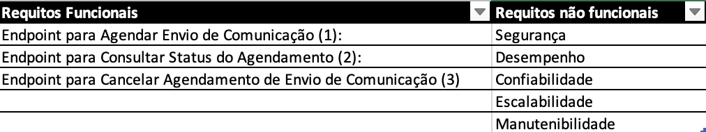
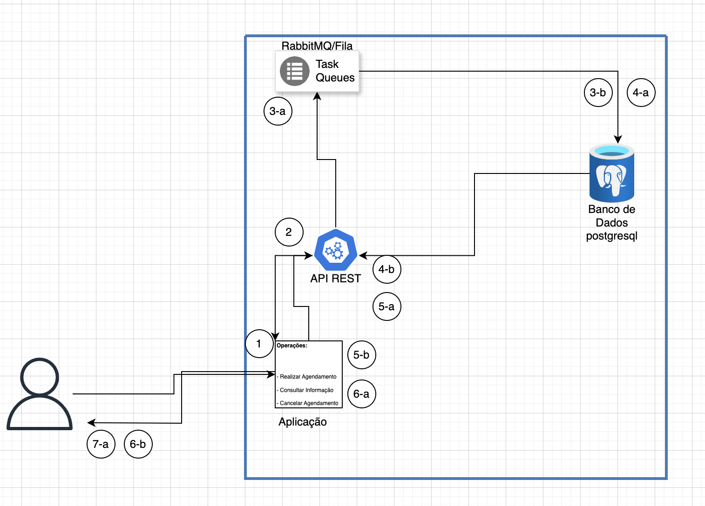
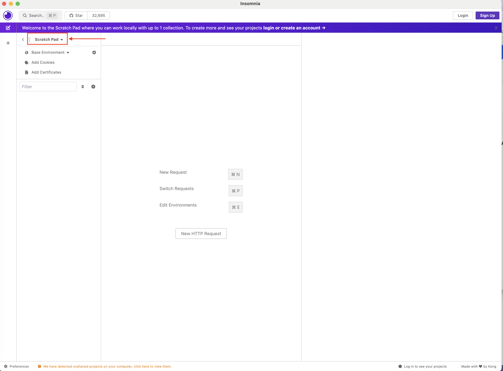
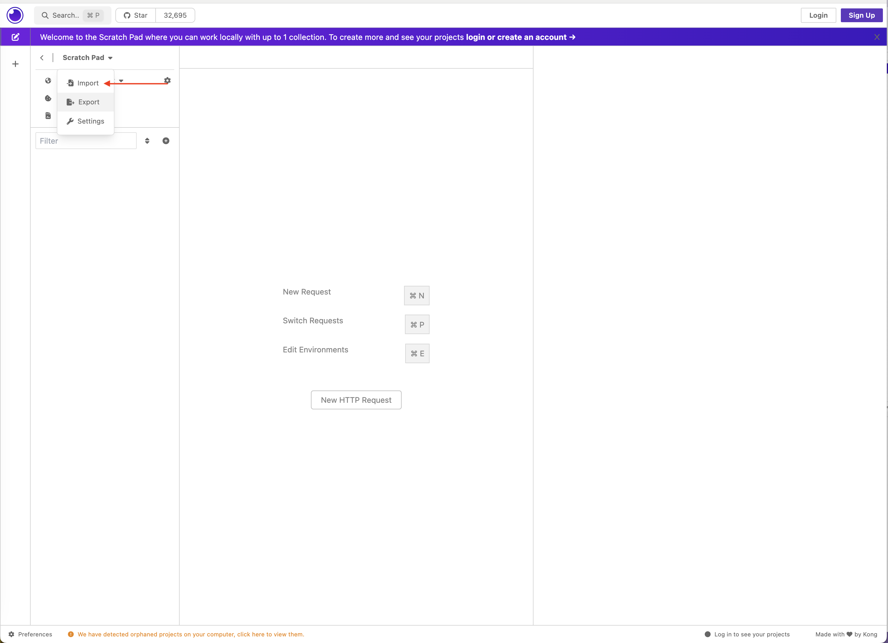
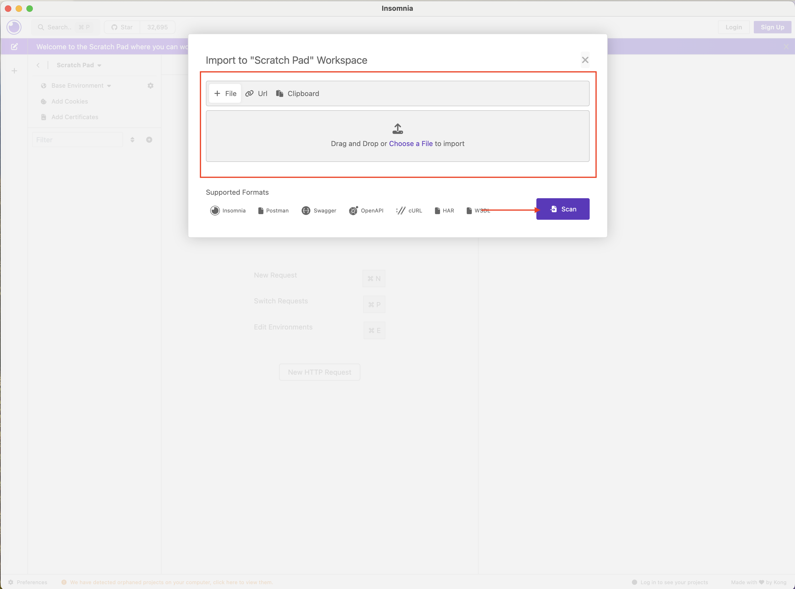
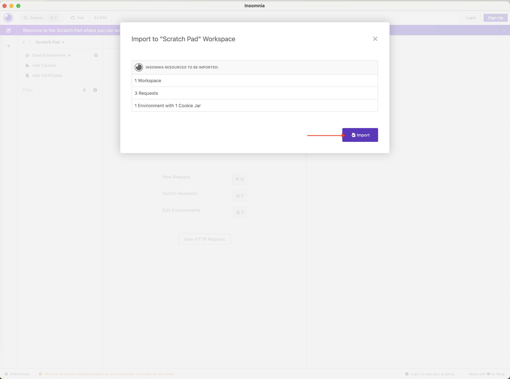
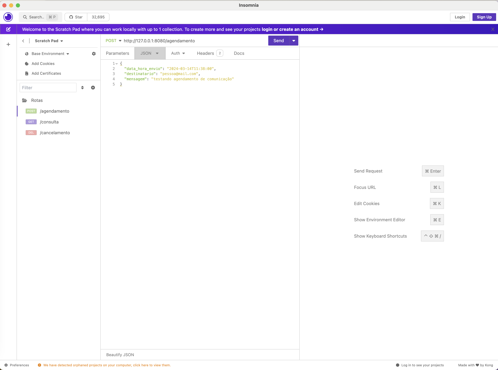

- [Projeto Plataforma Comunicação de Comunicação](#projeto-plataforma-comunicação-de-comunicação)
  - [Resumo do Escopo do projeto](#resumo-do-escopo-do-projeto)
  - [Requisitos Funcionais e Não Funcionais do Projeto](#requisitos-funcionais-e-não-funcionais-do-projeto)
  - [Arquitetura](#arquitetura)
  - [Estrutura do diretorio](#estrutura-do-diretorio)
  - [Configuração do ambiente de desenvolvimento](#configuração-do-ambiente-de-desenvolvimento)
    - [Supabase (Banco de dados)](#supabase-banco-de-dados)
  - [Entendendo as rotas da aplicação](#entendendo-as-rotas-da-aplicação)
    - [/agendamento](#agendamento)
    - [/consulta/](#consulta)
    - [cancelamento/int:id\*\*](#cancelamentointid)
  - [Executando a aplicação no Docker](#executando-a-aplicação-no-docker)
    - [Utilizando o Insomnia para testar a aplicação](#utilizando-o-insomnia-para-testar-a-aplicação)
  - [Teste Unitario da aplicação](#teste-unitario-da-aplicação)

## Projeto Plataforma Comunicação de Comunicação

### Resumo do Escopo do projeto

Desenvolvimento três endpoints relacionados ao envio de comunicações da empresa: agendamento, consulta e cancelamento.
Os agendamentos serão armazenados em um banco de dados e enviados para uma fila de mensagens. As APIs devem seguir o modelo RESTful, utilizar JSON e realizar testes unitários.
O desenvolvimento será realizado em Python, com suporte para PostgreSQL como banco de dados e RabbitMQ como sistema de mensageria.

### Requisitos Funcionais e Não Funcionais do Projeto

De acordo com o escopo desse projeto, foram levantados os seguintes requisitos funcionais e não funcionais, listados na figura a seguir:



Para modelar o banco de dados, foi criadada a tabela nomeada **Agendamento**, com os seguintes atributos:

- id: PRIMARY KEY
- data_hora_envio: TIMESTAMP
- destinario:TEXT
- mensagem: TEXT
- status: TEXT DEFAULT `agendado`

### Arquitetura

Para o desenvolvimento da task, após o levantamento de requisitos, foi implementada a seguinte arquitetura:



Explicação:

1 - A comunicação é feita com a aplicação, onde há três rotas: Realizar Agendamento, Consultar Informação, Cancelar Agendamento

2 - A escolha é enviada para API REST

**Se a operação for do tipo: Realizar Agendamento, ela será 3-a, 4-a, 5-a e 6-a**

**3.a** A solicitação é enviada para o RabbitMQ onde fica em uma fila para em seguida, ser registrada no banco de dados relacional

**4.a** O registro é feito no banco de dados

**5.a** E então é enviada para api rest

**6.a** o resultado da requisição é exibido  na aplicação

**Se a operação for do tipo: Consultar informação ou cancelar agendamento, será 3-b, 4-b e 5-b**

**3-b** A api rest envia uma solicitação para informação ser consultada ou cancelada no banco de dados

**4-b** A api rest retorna o resultado para a aplicação

**5-b** O resultado da requisição é exibido  na aplicação

### Estrutura do diretorio

```
.
├── Images
│   ├── Arquitetura.png
│   ├── Diagrama_De_Classe.png
│   └── RequisitosNFN.png
├── README.md
└── source
    └── rest_api
        ├── README.md
        ├── db
        │   ├── config.py
        │   └── initial_config.py
        ├── main.py
        ├── models
        │   └── request_model.py
        ├── rabbitmq
        │   └── rabbitmq.py
        └── test.py
        ├── requirements.txt
```

### Configuração do ambiente de desenvolvimento

O aquivo `.env.example` deve ser preenchido com suas proprias credenciais e deve ser renomeada para `env`.

#### Supabase (Banco de dados)

Para uso do postgresql, foi criado um banco através do supbase (<https://supabase.com/>)

Para utilizado:

1. Realize o cadastro ou faça o login caso já possua uma conta
2. Na página inicial, clique em `New Project`
3. Agora preencha o formulario com informações do seu projeto, para esse projeto, o nome escolhido foi `ml_bd`
4. Em seguida, escolha uma senha
5. A localização do seu banco de dados (escolha a região mais próxima de você por questões de latência)
6. Em seguida um plano
7. Clique em `Create new project`

Através do menu lateral, acesse as configurações e clique em database, use suas credenciais para preencher o arquivo que você renomeou como `env`

### Entendendo as rotas da aplicação

#### /agendamento
  
**Tipo de rota: POST**

Exemplo de requisição: <http://127.0.0.1:8080/agendamento>

**Corpo JSON:**

```
.
{
 "data_hora_envio": "2024-03-12T10:44:40",
 "destinatario": "nathalia@mail.com",
 "mensagem": "testando agendamento de comunicação"
}
```

Resultado esperado:

```
.
{
 "mensagem": "Agendamento realizado com sucesso"
}
```

#### /consulta/<destinatario>

**Tipo de rota: GET**

Exemplo de requisição: <http://127.0.0.1:8080/consulta/nathalia@mail.com>

**Resultado esperado:**

```
.
 {
  "data_hora_envio": "Tue, 12 Mar 2024 10:44:40 GMT",
  "destinatario": "nathalia@mail.com",
  "id": 33,
  "mensagem": "testando agendamento de comunicação",
  "status": "agendado"
 }
```

#### cancelamento/<int:id>**

Exemplo de requisição: <http://127.0.0.1:8080/cancelamento/31>

**Tipo de rota: DELETE**

**Resultado esperado:**

.
{
 "mensagem": "Cancelamento realizado com sucesso"
}
`

### Executando a aplicação no Docker

Essa aplicação conta com uma imagem **Docker** e um **docker-compose.yaml** dentro de seu diretório `/source/rest_api`

**-> É necessário que você possua Docker instalado em sua maquina.**

-> Para mais informações sobre Docker, você pode consultar os links abaixo:

- O que é docker? <https://www.redhat.com/pt-br/topics/containers/what-is-docker>
- Documentação oficial Docker (Disponivel em Inglês) <https://docs.docker.com>

No diretório do projeto, `/rest_api` e execute seguinte comando:

`docker-compose up -d`

O comando docker-compose up -d é usado para iniciar os serviços definidos em um arquivo docker-compose.yml em segundo plano (background).

******************************************************************************************************************************

up: Executa os serviços definidos no arquivo docker-compose.yml.
-d (--detach): Executa os contêineres em segundo plano, o que significa que você pode continuar usando seu terminal para outras tarefas sem interromper a execução dos contêineres.

******************************************************************************************************************************

#### Utilizando o Insomnia para testar a aplicação

No diretorio atual, na pasta Insomnia, você encontra um arquivo com as três rotas da aplicação, prontas para uso.

Abra o Insomnia e clique em **Scratch Pad**, como na imagem a seguir:



Em seguida, selecione a opção **import**



Faça upload ou arraste o arquivo Insomnia_2024-03-14.json localizando no diretório atual, na pasta Insomnia, e então clique em **Scan**



Em seguida, clique em **import**



Se tudo ocorrer bem, sua página deverá estar como a seguinte imagem:



-> Para saber mais sobre o Insomia: <https://docs.insomnia.rest> (Disponível em Inglês)

### Teste Unitario da aplicação

Para executar o teste unitario da aplicação é importante que ela esteja rodando no docker para que a aplicação possa se comunicar com o RabbitMQ e o Banco de dados.

Dentro do contexto: ./source/rest_api, execute no seu terminal: `python3 -m unittest test.py` ou `python -m unittest test.py` dependendo da versão de python em sua maquina.

