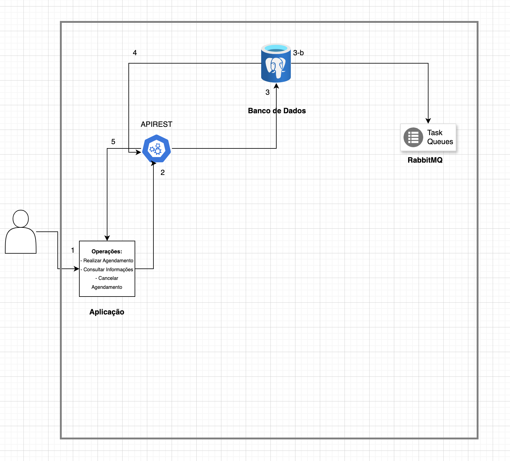

## Projeto Plataforma Comunicação de Comunicação 

De acordo com o escopo desse projeto, foram levantados os seguintes requisitos funcionais e não funcionais, listados na figura a seguir:


Para modelar o banco de dados, foi criadada a tabela nomeada **Agendamento**, com os seguintes atributos:

- id: PRIMARY KEY
- data_hora_envio: TIMESTAMP
- destinario:TEXT
- mensagem: TEXT
- status: TEXT DEFAULT `agendado`

Para o desenvolvimento da task, após o levantamento de requisitos, foi implementada a seguinte arquitetura:



Explicação:
1 - A comunicação é feita com a aplicação, onde é escolhido qual operação realizar: Realizar Agendamento, Consultar Informação, Cancelar Agendamento

2 - A escolha é enviada para API REST
**Se a operação for do tipo: Realizar Agendamento, ela será 3.a**

3.a A solicitação é enviada para o RabbitMQ onde fica em uma fila para em seguida, ser registrada no banco de dados relacional

4.a ser registrada no banco de dados relacional

5.a E então é enviada para api rest

6.a o resultado então chega na aplicação

**Se a operação for do tipo: Consultar informação, cancelar agendamento**

3-b a api rest envia uma solicitação para informação ser consultada no banco de dados

4-b a api rest retorna o resultado para a aplicação

5-b a aplicação exibe a resposta da solicitação

**Estrutura do diretorio**

```
.
├── Images
│   ├── Arquitetura.png
│   ├── Diagrama_De_Classe.png
│   └── RequisitosNFN.png
├── README.md
└── source
    └── rest_api
        ├── README.md
        ├── db
        │   ├── config.py
        │   └── initial_config.py
        ├── main.py
        ├── models
        │   └── request_model.py
        ├── rabbitmq
        │   └── rabbitmq.py
        └── test.py
        ├── requirements.txt
```